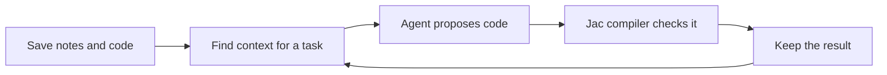

<div align="center">

# JacBrain

### A project memory for AI agents building with Jac.

Keep useful knowledge. Find what matters. Check it with the compiler.

[](https://github.com/CosmonautJones/jacbrain/actions/workflows/check.yml)
[](LICENSE)

[Try it](#try-it) · [How it works](#how-it-works) · [Roadmap](docs/ROADMAP.md)

</div>

---

## The idea

An AI coding agent often has to look up the same language rules and work through
the same errors across sessions. **JacBrain gives it a place to keep and find
that knowledge.**

It connects notes, code, compiler errors, and candidate fixes in a knowledge
graph: a collection of records linked by how they relate. When an agent starts
a task, JacBrain returns a small selection of relevant records for that project
and Jac version.

The goal is to build effectively with Jac using less repeated explanation and
fewer reference tokens. JacBrain supplies reusable language knowledge even when
an agent does not reliably know Jac. It does not retrain the agent.

## How it works



For example, an agent working on an **offer-search walker** can ask for related
notes and code. JacBrain returns matching records with their sources. The agent
can then submit a candidate snippet to the real Jac compiler and keep the result
for later retrieval.

**A compiler pass means the snippet compiles.** Tests are still needed to show
that it behaves correctly.

## Try it

You need **Python 3.11+**. This first example needs no Jac installation, API key,
or extra Python packages. These commands work in PowerShell or Bash:

```sh
git clone https://github.com/CosmonautJones/jacbrain.git
cd jacbrain

# Save a sample note and code file
python -m jacbrain ingest examples/walker-note.md --project demo
python -m jacbrain ingest examples/walker-pattern.jac --project demo

# Ask for relevant context
python -m jacbrain context "walker Offer traversal" --project demo
```

You’ll get JSON containing matching records, their sources, and validation
status. Data stays in `.jacbrain/brain.sqlite3` on your machine. Choose only
nonsecret files to ingest.

**Next:** [connect a coding agent and enable compiler checks →](docs/GETTING-STARTED.md)

### Load Jac's actual reference guides

With Jac 0.37.23 available, import its bundled knowledge once:

```sh
python -m jacbrain sync-guides
python -m jacbrain context "walker with one typed report after traversal" --project my-app
```

This imports the installed guides, splits them into source-linked sections,
and connects their explicit references. Task queries can then use that language
knowledge alongside your project's notes. Re-run the import to refresh it.
See the [Windows setup](docs/GETTING-STARTED.md) if Jac runs in WSL.

## Where it stands

**Early working foundation.** You can use the local tools today; the complete
learning loop is still being built.

| Working today | Still to build |
| :--- | :--- |
| Import versioned Jac guides and save project evidence locally | Extract project relationships with Jac’s compiler |
| Retrieve context by task, project, and Jac version | Connect the native Jac graph to persistent storage |
| Check snippets through Jac MCP and save the results | Verify fixes against full projects and behavioral tests |
| Use the CLI, MCP interface, and separate Jac graph demo | Measure broader tasks, repairs, and graph-specific value |

The persistent service currently uses Python and SQLite. The Jac nodes, edges,
and walkers form a separate runnable graph model. “Learning” here means keeping
evidence across sessions, not training an AI model.

### First measured result

In a four-task pilot, selected context used **73% fewer reference tokens** than
curated complete guides. Both approaches passed all four compiler and behavior
checks. Total observed model input fell by **16%**, including tool overhead.

That is an encouraging small result, not proof of general savings. Graph and
plain section retrieval returned identical context, so the graph itself has
not yet shown an advantage. [Read the experiment and its limits →](benchmarks/results/2026-09-29/README.md)

## Explore further

| I want to… | Start here |
| :--- | :--- |
| Connect my agent or check code | [Setup guide](docs/GETTING-STARTED.md) |
| Understand the design | [Architecture](docs/ARCHITECTURE.md) |
| Run the native Jac graph | [Graph demo](graph/README.md) |
| See the API and data format | [Interfaces](docs/INTERFACES.md) · [Schema](schemas/evidence.schema.json) |
| See what was tested | [Verification](docs/VERIFICATION.md) |
| Contribute or troubleshoot | [Development guide](CONTRIBUTING.md) |

Jac already provides MCP tools and code-context queries. JacBrain builds on that
work and explores memory across tasks. Our [prior-art review](docs/PRIOR-ART.md)
covers related projects and the questions we still need to test.

---

Built by [Travis Jones](https://github.com/CosmonautJones), inspired by working
with Jac on the [M-Local team project](https://github.com/CosmonautJones/m-local).
Independent of the Jac/Jaseci maintainers. [MIT licensed](LICENSE).
