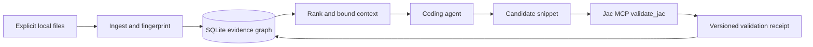

# JacBrain architecture

JacBrain is a local engineering memory for coding agents working in Jac. It
reduces repeated context gathering by returning a small, attributable evidence
packet for a task. It does not train model weights or treat remembered fixes as
ground truth.

## First useful slice

An explicit local document or Jac file is ingested into a versioned evidence
graph. A query selects matching records and one-hop dependencies within a hard
UTF-8 byte budget. A candidate snippet is sent to the real `jac mcp` process;
the response, source digest, and installed compiler version are recorded.
Only a successful, matching compiler receipt promotes a candidate to
`compiler_validated`. That label never implies runtime correctness.

## Components and boundaries

* `jacbrain/store.py`: transactional SQLite records, typed relations, receipts.
* `jacbrain/ingest.py`: explicit Markdown/text/Jac ingestion. Jac declaration
  extraction is lexical scaffolding, not a resolved compiler symbol graph.
* `jacbrain/retrieve.py`: deterministic lexical ranking plus one-hop graph
  context, exact version/project filters, conservative serialized byte bound.
* `jacbrain/validation.py`: bounded stdio MCP client; only `validate_jac` is
  called. No arbitrary command execution or snippet execution is exposed.
* `jacbrain/server.py`: small stdio MCP-facing adapter for local agents.
* `graph/`: independently runnable Jac-native node/edge/walker model. This is
  the target native execution model, not yet the SQLite service's backing store.

The Python adapter is a portable, inspectable reference implementation. The
Jac graph scaffold is verified separately. Bridging them without losing evidence
semantics is a named milestone, not an implied completed feature.

## Evidence model

Record kinds: Concept, Document, Symbol, Diagnostic, Fix, Pattern, Task,
Validation. Every record has project, Jac version, source URI, content digest,
and immutable content. Content-addressed IDs prevent a changed source from
silently inheriting validation. Relations encode documents, depends_on, fixes,
validates, produced, and used_in. A receipt captures compiler version and the
exact candidate hash. Compiler rejection and unavailable tooling remain distinct.

## Trust and failure handling

Retrieved content is untrusted data, never instructions. File ingestion is
explicit and local; directory crawling and network fetching are excluded.
Content is not secret-scanned: choose only appropriate nonsecret files.
SQLite transactions make retries idempotent. Missing Jac, timeout,
protocol errors and version mismatch cannot promote evidence. MCP listens only
on stdio and mutations remain local. Compilation is not a sandbox: validate
only trusted source on a trusted machine; hostile imports/comptime are outside
this MVP threat model. Shared users, remote hosting and adversarial code need
isolation before enabling validation.

## Evaluation

Compare full docs, official Jac MCP alone, lexical retrieval, and graph-expanded
retrieval on held-out Jac tasks. Measure serialized context bytes, actual model
tokens with a named tokenizer, compiler acceptance, behavioral tests, repair
rounds and wall time. Do not claim token savings or task-quality gains until
those measurements exist. Old versions are filtered, not silently substituted.
